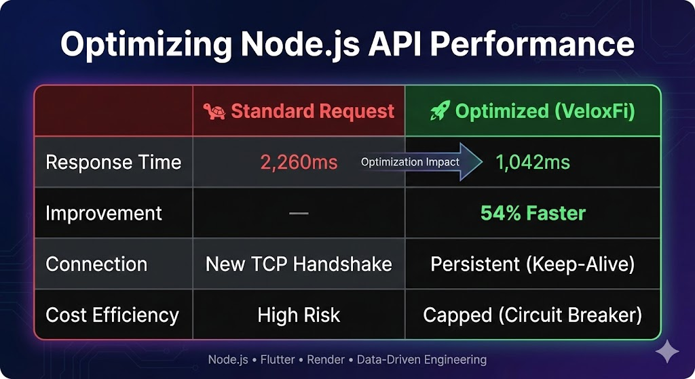
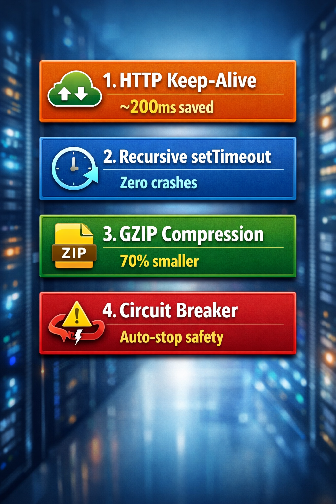
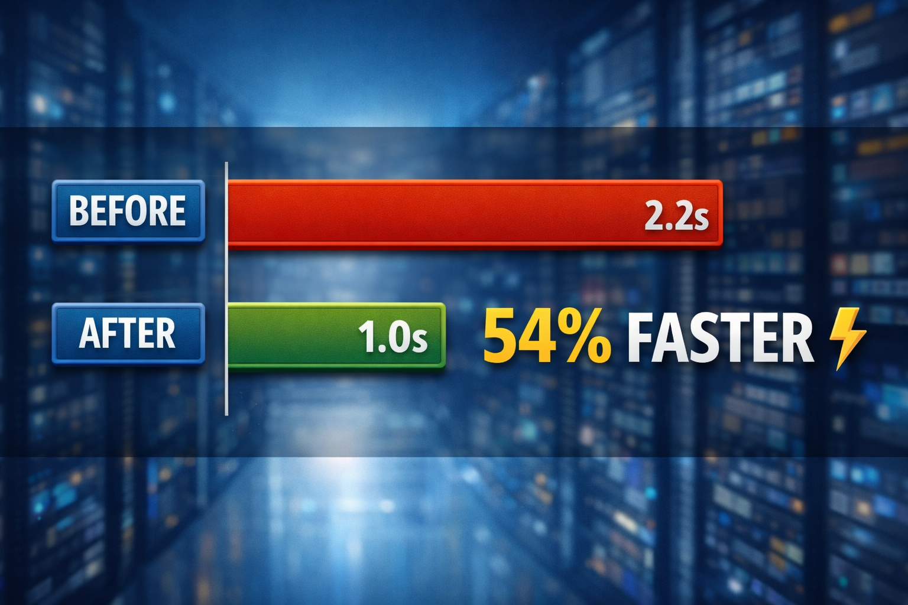

# VeloxFi - Real-Time Crypto Watcher 🚀

A full-stack cryptocurrency price tracker with Tinder-style swipe animations. Built with performance-first backend optimizations and smooth Flutter animations.

[](https://streamable.com/loieth)

**🔗 [Watch Demo Video](https://streamable.com/loieth)**

---

## ✨ Features

### Frontend (Flutter)

- 🎴 Tinder-style swipe animations
- 📊 Real-time crypto data (30+ coins)
- 🎨 Dark theme UI
- 🔄 Auto-refresh every 15 minutes
- 📱 Cross-platform (iOS, Android, Web)

### Backend (Node.js)

- ⚡ Optimized API calls with Keep-Alive
- 💾 Smart caching layer
- 🛡️ Circuit breaker pattern
- 🗜️ Gzip compression
- 🌐 Backend Deployed on Render

---

## 🔧 Backend Optimizations



| Optimization | What it does | Benefit |
|--------------|--------------|---------|
| Keep-Alive | Reuses TCP connections | Saves 100-200ms per request |
| setTimeout | Prevents request pile-up | Safer than setInterval |
| Gzip | Compresses responses | ~80% smaller payloads |
| Circuit Breaker | Hard limit on API calls | Prevents runaway costs |

---

## Data Flow



---

## Getting Started

### Prerequisites

- Node.js 18+
- Flutter 3.x
- CoinCap API Key

### Backend Setup

```bash
cd backend
npm install
```

Create `.env` file:
```env
COIN_CAP_API_KEY=your_api_key
PORT=8000
```

Start server:
```bash
npm start
```

### Frontend Setup

```bash
cd frontend
flutter pub get
```

Update `lib/api_base.dart` with your backend URL:
```dart
class BaseUrl {
  static String getBaseUrl() {
    return "https://your-backend-url.onrender.com/api/live";
  }
}
```

Run app:
```bash
flutter run
```

---

## Project Structure

```
VeloxFi-Real-Time-Watcher/
├── backend/
│   ├── server.js          # Express server with optimizations
│   ├── package.json
│   └── .env
├── frontend/
│   ├── lib/
│   │   ├── main.dart      # UI + Swipe animations
│   │   ├── provider.dart  # State management
│   │   ├── api_base.dart  # API config
│   │   ├── model/
│   │   │   └── data_model.dart
│   │   └── service/
│   │       └── api.dart
│   └── pubspec.yaml
├── optimization_image.jpg
├── four_optimization_step.png
├── data_visualisation_img.png
└── README.md
```

---

## Tech Stack

| Layer | Technology |
|-------|------------|
| Frontend | Flutter, Provider |
| Backend | Node.js, Express, Axios |
| API | CoinCap API |
| Deployment | Render |

---

## Animation Details

The swipe animation uses:

- `AnimationController` for timing
- `GestureDetector` for drag handling
- `Transform.translate` for position
- `Transform.rotate` for tilt effect
- `Curves.elasticOut` for bounce

---

Built with ❤️ by [Pinki Singh](https://github.com/Pinkisingh13)
